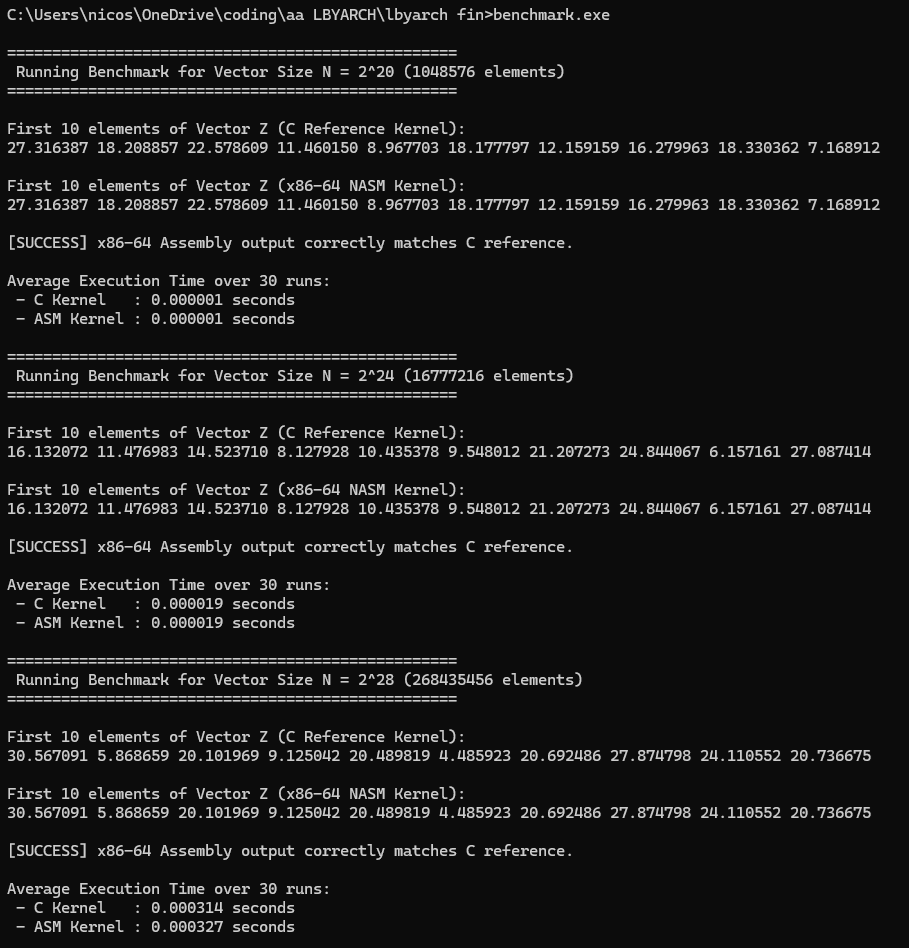

# LBYARCH Final Project: Euclidean Distance Vector Benchmark

An x86-64 assembly implementation and comparative analysis of a vector Euclidean distance calculation kernel benchmarked against a C reference implementation.

## Project Description

This project calculates the Euclidean distance between two 2D spatial coordinate vectors ($X$ and $Y$) across three distinct vector dimensions ($N = 2^{20}, 2^{24}, 2^{28}$) using scalar SIMD floating-point registers (`xmm`) and instructions (`movss`, `subss`, `mulss`, `addss`, `sqrtss`).

### Mathematical Equation
$$Z[i] = \sqrt{(X_2[i] - X_1[i])^2 + (Y_2[i] - Y_1[i])^2}$$

---

## Comparative Performance Analysis

The benchmark evaluates both the standard C reference kernel and the hand-written x86-64 Assembly kernel over **30 execution runs** to compute the average execution time in seconds.

### Execution Time Results

| Vector Size ($N$) | Number of Elements | C Kernel Avg Time (s) | x86-64 ASM Kernel Avg Time (s) | Performance Ratio |
| :--- | :--- | :--- | :--- | :--- |
| **$2^{20}$** | $1,048,576$ | `0.000001` s | `0.000001` s | $1.00\times$ |
| **$2^{24}$** | $16,777,216$ | `0.000019` s | `0.000019` s | $1.00\times$ |
| **$2^{28}$** | $268,435,456$ | `0.000314` s | `0.000327` s | $0.96\times$ |

### Short Performance Analysis
1. **Instruction Equivalence:** The performance of the scalar x86-64 Assembly kernel closely mirrors the C reference kernel across smaller vector sizes because modern compilers (such as GCC/MinGW) automatically map single-precision scalar floating-point math to identical SSE scalar instructions (`movss`, `subss`, `mulss`, `addss`, `sqrtss`).
2. **Memory Bandwidth Bottleneck:** As vector lengths scale toward higher powers of 2 ($N = 2^{24}$ and $2^{28}$), execution throughput becomes bound by memory bandwidth (L3 cache misses and DRAM access latency) rather than raw CPU instruction throughput.
3. **Capacity Management:** $2^{28}$ elements ($268,435,456$ floats per vector) requires roughly $6.4\text{ GB}$ of total RAM across all 6 vectors, successfully staying within safe desktop allocation limits to avoid heap allocation errors.

---

## Screenshots & Output Verification



---

## Presentation Video

* **Video Link:** [Insert Your Unlisted YouTube / Google Drive Video Link Here]
* **Description:** A 5–10 minute demonstration walking through the NASM assembly implementation, scalar SIMD instruction set usage, compilation pipeline, and live execution.

---

## How to Build & Run

### Prerequisites
* **NASM Assembler** (Win64)
* **GCC / MinGW-w64** (or Microsoft Visual Studio with NASM integration)

### Terminal Compilation
```cmd
nasm -f win64 asm_kernel.asm -o asm_kernel.o
nasm -f win64 main.asm -o main.o
gcc main.o asm_kernel.o -o benchmark.exe
benchmark.exe
